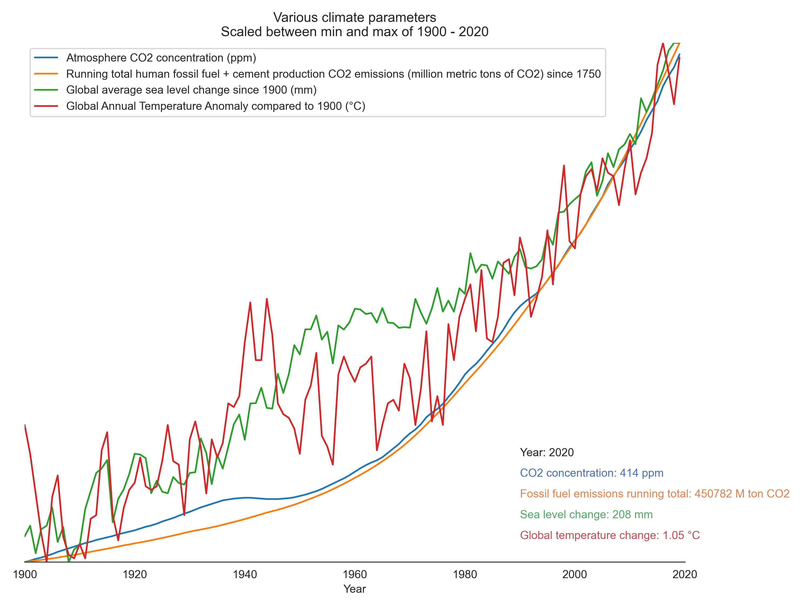

# What is this?

A script that create a plot that shows the change of various climate parameters between 1900 and 2020.



# Usage

Build a python environment and install dependencies:

```
python -m venv env
.\env\Scripts\activate
python scripts.py
```

# Data Sources

CO2 to 2005: https://data.giss.nasa.gov/modelforce/ghgases/CMIP5/CO2_OBS_1850-2005.lpl
CO2 from 2006: ftp://aftp.cmdl.noaa.gov/products/trends/co2/co2_annmean_mlo.csv
Fossil Fuel Emissions to 1958: https://cdiac.ess-dive.lbl.gov/trends/emis/tre_glob_2014.html
Fossil Fuel Emissions from 1959: https://www.icos-cp.eu/science-and-impact/global-carbon-budget/2020
Sea level change: https://podaac.jpl.nasa.gov/dataset/JPL_RECON_GMSL#faceted-browse-dataAccess
Global Temperature Anomaly: https://www.ncdc.noaa.gov/cag/global/time-series/globe/land_ocean/ann/12/1900-2020